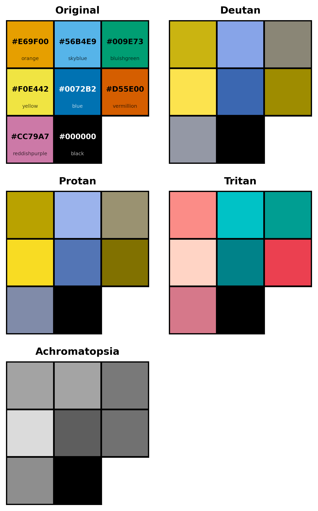
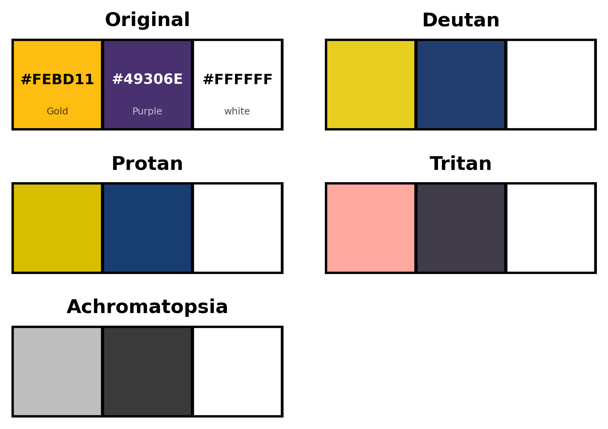
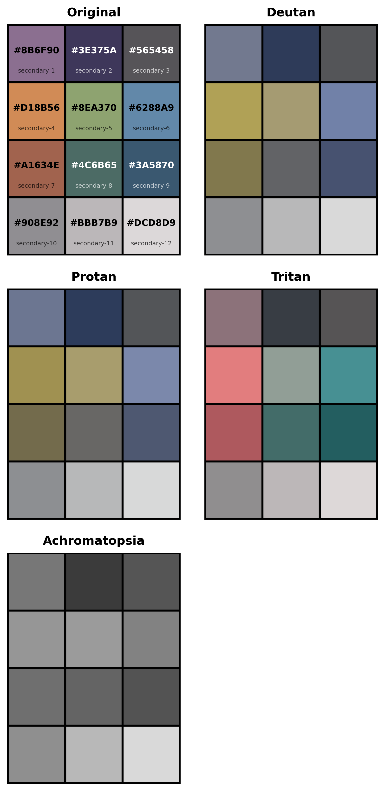

# Color Palette Accessibility Readme

The python code above can generate swatches like the one shown below (Okabe-Ito Colorblind Friendly Palette). It generates simulations of different color vision deficiencies (CVD):

- the original palette. (No deficiency).
- palette simulated with "Deutan CVD", which affects green perception. This is the most common form of CVD.
- palette simulated with "Protan CVD", which affects red perception. Another form of red-green colorblindness, but less common.
- palette simulated with "Tritan CVD", which affects blue perception. Causes blue/green color confusion.
- palette simulating "Achromatopsia", or total colorblindness. Only perceived luminence is shown.

## Internal Functions

- `simulate_cvd(colors, deficiency)`
    - `colors`:  list of HEX color codes as strings: ("#E69F00", "#56B4E9")
    - `deficiency`: Single deficiency from list "deuteranomaly", "protanomaly", "tritanomaly", "achromatopsia" as string.
    - Output: New list of simulated colors.
- `check_colorblindness(colors, names=None, label=True, outfile="colorblind_check.png")`
    - `colors`: list of HEX color codes as strings: ("#E69F00", "#56B4E9")
    - `names`: names of color codes to print on original palette.
    - `label`: boolean, determins if names are printed or not.
    - `outfile`: name of file to generate with color swatches.
- `shorten_name(name, max_len=18)`
    - Internal function to truncate long names in labels.
- `generate_all_palettes_from_json(json_file, output_dir=".")`
    -  `json_file`: input file with list of colors (`palette` prefix for output filenames, `changed`, ignore generating files already processed, `colors` list of name/color pairs.)
    - `output_dir`: Location to place output file. Defaults to current directory.

### Sample json file:
```
{
  "palettes": [
    {
      "palette": "okabe-ito",
      "changed": false,
      "colors": [
        {
          "name": "orange",
          "color": "#E69F00"
        },
        {
          "name": "skyblue",
          "color": "#56B4E9"
        },
        {
          "name": "bluishgreen",
          "color": "#009E73"
        },
        {
          "name": "yellow",
          "color": "#F0E442"
        },
        {
          "name": "blue",
          "color": "#0072B2"
        },
        {
          "name": "vermillion",
          "color": "#D55E00"
        },
        {
          "name": "reddishpurple",
          "color": "#CC79A7"
        },
        {
          "name": "black",
          "color": "#000000"
        }
      ]
    }
  ]
}
```

### Sample Output:

#### Okabe-Ito Colorblind Friendly Palette



#### Minnesota State University, Mankato's Brand Color Palettes



